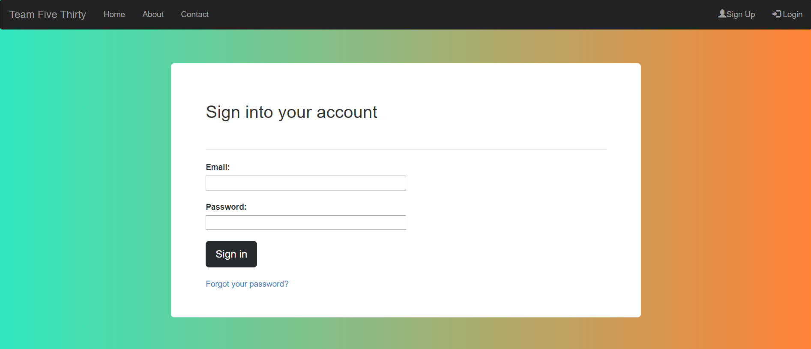

# Employee-Rating-System
Users answer survey questions based upon their customer experience. The results are displayed anonymously for the employee to view.

Created using HTML, CSS, and Bootstrap.
This website was quickly created for a group project at University.
This website is an employee rating system where the employees are surveyed by customers.

After survey submission, customer ratings are anonymous and can only be viewed by the employee and admin.
Employees can then log into their account to view their own survey answers. They cannot view the ratings of their peers.
Admins have the ability to search for employees and view all employee ratings.

I have not yet created:
* Survey sent confirmation
* Account creation confirmation
* Password recovery link sent
* Employee UI
* Admin UI